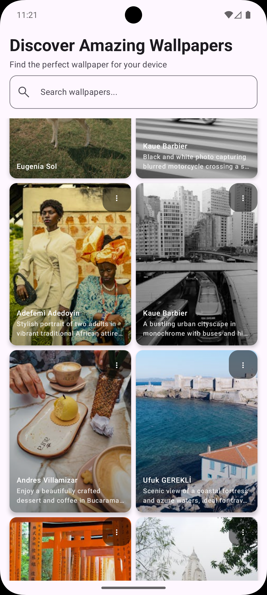
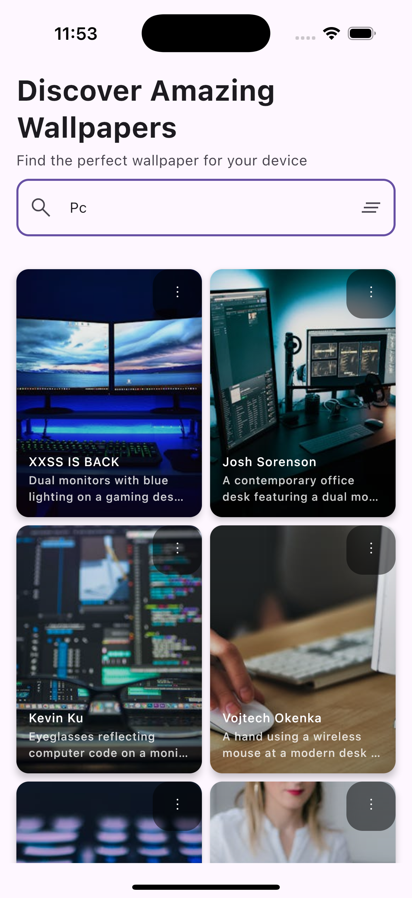

# Pexels KMP


## Description

Pexels KMP is a multiplatform application that displays high-quality images from the Pexels API. The application is developed using Kotlin Multiplatform, allowing code sharing across different platforms.

## Features

- 📱 Modern and responsive interface
- 🎨 High-quality images
- 📱 Android support
- 💻 Desktop support
- 📱 iOS support

## Technologies

- Kotlin Multiplatform
- Compose Multiplatform
- Ktor (for the API)
- DI (Dependency Injection)
- MVVM (Architecture)

## Project Structure

```
PexelsKMP/
├── composeApp/           # Shared code
│   ├── src/commonMain/  # Common code
│   ├── src/iosMain/     # iOS-specific code
│   └── src/androidMain/ # Android-specific code
├── iosApp/              # iOS-specific code
```

## Usage Examples

<table>
  <tr>
    <th>Android</th>
    <th>iOS</th>
  </tr>
  <tr>
    <td></td>
    <td></td>
  </tr>
</table>

